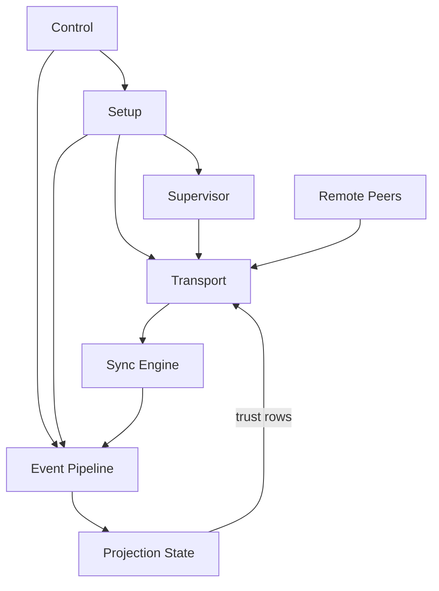

# 🐭 Topo

A proof-of-concept sketch of the (work-in-progress) Topo protocol: an event-sourced, end-to-end encrypted, batteries-included, peer-to-peer backend for building complex applications such as team chat.

Informed by work on [Quiet](https://github.com/TryQuiet).

See [Motivation](docs/DESIGN.md#Motivation) and [How It Works](docs/DESIGN.md#How_It_Works) for more detail.

**TL;DR:** 
command 🡪 create event 🡪 sign, encrypt, hash 🡪 peer via QUIC 🡪 check mTLS against event source of truth 🡪 set reconcile 🡪 topo sort 🡪 decrypt 🡪 SQLite 🡪 query

> **🚨 VIBE-CODED & NOT FOR PRODUCTION USE 🚨**

## Quick Start

### Prerequisites

- Rust toolchain (`cargo`, `rustc`)
- SQLite (bundled via `rusqlite` feature in this repo)

### Running the CLI

Install the `topo` binary, then use it directly:

```bash
cargo install --path .
topo --help
```

### Shell Completions

```bash
eval "$(topo completions bash)"
```

### CLI Preview

Alice creates a workspace and invites Bob, who then accepts:

```text
$ topo --db alice.db start --bind 127.0.0.1:7443
$ topo --db alice.db create-workspace --workspace-name "Activism" --username alice --device-name laptop
$ topo --db alice.db create-invite --public-addr 127.0.0.1:7443
$ topo --db bob.db start --bind 127.0.0.1:7444
$ topo --db bob.db accept-invite --invite "topo://invite/eyJ2IjoxLCJ3b3Jrc3BhY2VfaWQiOiIyZjRhLi4uN2I5MSIsLi4ufQ==" --username bob --devicename phone
```

Later, their conversation might look like:

```text
$ topo --db alice.db view --limit 8

  Activism
    USERS: alice (you), bob
    ACCOUNTS: alice/laptop (you), bob/phone

  ────────────────────────────────────────

    alice [38s ago]
      1. hey bob - welcome to Activism
         🔥 bob

    bob [22s ago]
      2. thanks! invite flow worked first try
         🎉 alice
      3. nice, I can see your file attachment

    alice [18s ago]
      4. File 0
```


### Running Tests

The test suite seeks to prove that the proof-of-concept meets correctness and performance requirements.  

```bash
# Full test suite
cargo test

# Performance tests
cargo test --release --test perf_test -- --nocapture

# Sync graph tests (serial required)
cargo test --release --test sync_graph_test -- --nocapture --test-threads=1

# Low-memory realism/perf matrix
scripts/run_perf_serial.sh lowmem
```

## Architecture

```text
Cargo.toml              # crate/dependency config; declares `topo` bin path
src/runtime/control/main.rs  # `topo` CLI + daemon entrypoint

src/
  lib.rs                 # shared crate surface used by runtime/tests
  runtime/               # daemon control plane, peering loops, transport boundary
  event_modules/         # event-local commands, queries, wire formats, projectors
  state/                 # SQLite storage, queues, projection/apply pipeline
  shared/                # cross-cutting constants, IDs, crypto helpers
  testutil/              # deterministic fixtures/helpers used by integration tests

tests/
  sync_contract_tests/   # sync correctness and convergence contracts
  projectors/            # projector behavior and ordering tests
  *_test.rs              # CLI/RPC/perf/lowmem/system tests

```

### High Level Data Flow

See: [DESIGN_DIAGRAMS.md](DESIGN_DIAGRAMS.md) for more.



### TLA+ Model

The proof-of-concept models its DAG and bootstrap transport logic in TLA+. (Probably amateurish, but helpful for avoiding dependency cycles and guiding LLM-driven implementation.)

Core model files:

- `docs/tla/EventGraphSchema.tla`
- `docs/tla/TransportCredentialLifecycle.tla`
- `docs/tla/UnifiedBridge.tla`

Fast TLC checks (uses bundled `docs/tla/tla2tools.jar`):

```bash
cd docs/tla
./tlc event_graph_schema_fast.cfg
./tlc TransportCredentialLifecycle transport_credential_lifecycle_fast.cfg
./tlc UnifiedBridge unified_bridge_progress_fast.cfg
```

## Documentation

- **[docs/DESIGN.md](./docs/DESIGN.md)** - Protocol semantics, runtime invariants, and module ownership boundaries
- **[docs/PLAN.md](./docs/PLAN.md)** - Execution phases, acceptance criteria, and test gates
- **[docs/DESIGN_DIAGRAMS.md](./docs/DESIGN_DIAGRAMS.md)** - Code-accurate runtime/data-flow diagrams
- **[docs/INDEX.md](./docs/INDEX.md)** - Documentation index
- **[docs/PERF.md](./docs/PERF.md)** - Performance results
- **[High-Level Runtime Boundaries Diagram](./docs/DESIGN_DIAGRAMS.md#3-high-level-runtime-boundaries)** - Architecture at a glance

## Stretch Goal 

A protocol that is simple enough to implement in a weekend project but adequate for building a reliably p2p Slack replacement.

## Status

Not simple enough yet.

## Why "Topo"?

[Topo sort](https://en.wikipedia.org/wiki/Topological_sorting) is something it does a lot. Topo means "mouse" in Italian. We built it for [Quiet](https://tryquiet.org). Mice are quiet ("quiet as a mouse"). 🐭
