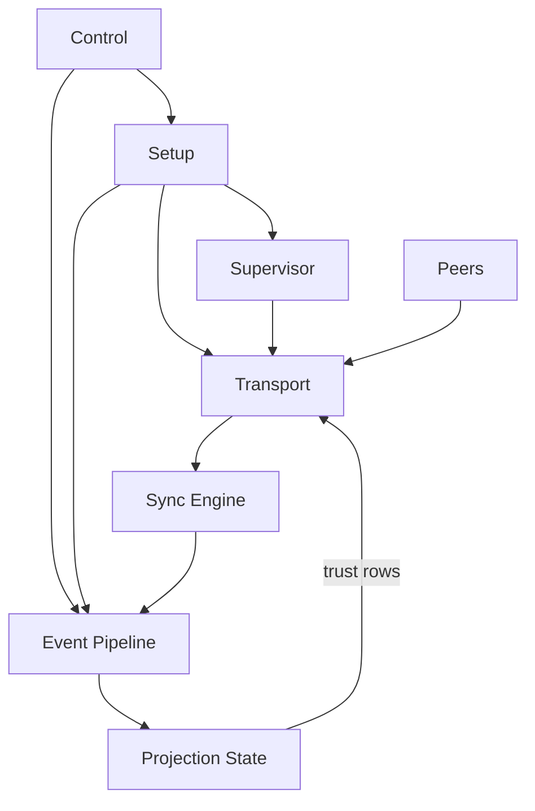

# Topo Protocol - POC #7

A proof-of-concept implementation of the Topo protocol: an event-sourced, end-to-end encrypted, peer-to-peer team chat stack with daemon-first runtime, real QUIC networking, and deterministic projection semantics.

## CLI Walkthrough

Plausible terminal transcript showing: create a community/workspace, invite Bob, chat back and forth, and view the message list.

```bash
$ topo --db alice.db start --bind 127.0.0.1:7443
listen: 127.0.0.1:7443
🐭 Topo daemon started (db=alice.db, socket=.../alice.db.topo.sock)

$ topo --db alice.db create-workspace --workspace-name "Team Orbit" --username alice --device-name laptop
peer_id:      9fe0...c12a
workspace_id: 2f4a...7b91

$ topo --db alice.db create-invite --public-addr 127.0.0.1:7443
topo://invite/eyJ2IjoxLCJ3b3Jrc3BhY2VfaWQiOiIyZjRhLi4uN2I5MSIsLi4ufQ==
Created invite #1

$ topo --db bob.db start --bind 127.0.0.1:7444
listen: 127.0.0.1:7444
🐭 Topo daemon started (db=bob.db, socket=.../bob.db.topo.sock)

$ topo --db bob.db accept-invite --invite "topo://invite/eyJ2IjoxLCJ3b3Jrc3BhY2VfaWQiOiIyZjRhLi4uN2I5MSIsLi4ufQ==" --username bob --devicename phone
Accepted invite
  peer_id: d18b...aa43
  user:    W5De...0OM=
  peer:    nI4Q...Lvk=

$ topo --db alice.db send "hey bob — welcome to Team Orbit"
Sent: hey bob — welcome to Team Orbit
event_id:0f9d...d6c1

$ topo --db bob.db send "thanks! invite flow worked first try 🙌"
Sent: thanks! invite flow worked first try 🙌
event_id:7a21...bb09

$ topo --db alice.db generate-files --count 1 --size-mib 1
Generated 1 files (1 MiB each, 4 slices/file, total slices 4) in alice.db

$ topo --db alice.db messages --limit 8
MESSAGES (4 total):

  alice [38s ago]
    1. hey bob — welcome to Team Orbit
    2. File 0

  bob [22s ago]
    3. thanks! invite flow worked first try 🙌
    4. nice, i can see your file event too
```

## Start Here

- **[docs/DESIGN.md](./docs/DESIGN.md)** - Protocol/runtime design and invariants
- **[docs/PLAN.md](./docs/PLAN.md)** - LLM-friendly implementation plan
- **[docs/PERF.md](./docs/PERF.md)** - Performance results
- **[High-Level Runtime Boundaries Diagram](./docs/DESIGN_DIAGRAMS.md#3-high-level-runtime-boundaries)** - Architecture at a glance

## Goal & Context

The PoC exists to prove the practicality of a principled approach to local-first/p2p/e2ee messaging. 

Specifically, it seeks to prove that the following features and princples are practical:

1. **SQLite-centricity** - All persistance, including files, is in SQLite.
1. **Event Sourcing** - Canonical events are durable facts. All canonical data is expressed as events, and state can be generated/restored deterministically by replaying events.
1. **Content Addressing** - All events are identified by the hash of the canonicalized event (the encrypted version if encrypted, the signed plaintext version if not)
1. **Explicit Semantic Dependency** - Rather than making events depend arbitrarily on prior events (like Automerge, OrbitDB) application developers decide what depencies are important for product needs and make them required event fields pointing to dependency event id's
1. **Dependency-agnostic Set Reconciliation** - We use a set reconciliation algorithm (Negentropy) that eventually and efficiently syncs all events we don't yet have, without using the dependency graph (as OrbitDB or Git would)
1. **Topological Sort** - Events block when dependencies are missing, and unblock with topological sort (Khan's algorithm).
1. **Keys Are Just Dependencies** - There are no special queues for events with missing signer or decryption keys: these are just declared dependencies (key material is stored in events with id's) and block/unblock accordingly.
1. **Projection** - Events are queued for validation and "projected" (materialized) into SQLite rows in atomic transactions
1. **Deterministic Query-time Winners** - Rather than applying destructive database updates that can create ordering problems, events updating a single state instead add rows using INSERT OR IGNORE; a single winner is determined at query time.
1. **Flat, Fixed-length Events** - To simplify secure parsing, all events and fields are fixed-length and canonicalized
1. **Ephemeral Protocol Messages** - Runtime protocol traffic (sync/intros/holepunch control) is not canonical event data.
1. **Conventional Networking Primitives** - All networking (including local networking) happens over QUIC with transport layer security provided by mTLS, but transport identity depends on the event-sourced auth layer for checking incoming and outgoing connections, and dropping connections.
1. **In-band Relay, Discovery, Intro** - Reliable notifications are a requirement, so always-online sync-capable nodes are a requirement, so dedicated STUN/TURN servers and relay servers are inadequate, and we can rely on reachable (non-NAT) peers or cloud nodes to relay data through normal sync operation, and introduce NAT'ed peers by their observed addresses/ports.
1. **QUIC Holepunching** - Once intro'ed by a mutually reachable peer, peers holepunch with simultaneous QUIC connections
1. **Convergence Testing** - Tests check that for all relevant scenarios, reverse reorderings of events, or duplicated event replays, yield the same state.
1. **Real Networking in Tests** - All multi-client tests are realistic as possible: real networking using CLI-controlled daemons with local peer discovery.
1. **Easy Synchronous Testing Workflows** - CLI workflows remain synchronous enough for imperative command chains (create workspace with user, invite user, join as user, etc.)
1. **Multitenancy** - Multiple user accounts/workspaces are first-class, with `recorded_by` scoping on shared tables (for example one message table, scoped to many local users). Canonical facts remain event-sourced in `events`; `recorded_events` is a local tenant ingest journal used to decide which canonical events replay for each tenant.

## Quick Start

### Prerequisites

- Rust toolchain (`cargo`, `rustc`)
- SQLite (bundled via `rusqlite` feature in this repo)

### Running the CLI

You can test the proof-of-concept by playing with its CLI either locally, over a LAN (with autodiscovery), or with remote peers.

```bash
cargo run --bin topo -- --help
```

### Running Tests

The test suite seeks to prove that the proof-of-concept meets correctness and performance requirements.  

```bash
# Full test suite
cargo test

# Performance tests
cargo test --release --test perf_test -- --nocapture

# Sync graph tests (serial required)
cargo test --release --test sync_graph_test -- --nocapture --test-threads=1

# Low-memory realism/perf matrix
scripts/run_perf_serial.sh lowmem
```

## Architecture

```text
src/
  runtime/               # Daemon control plane, peering loops, transport boundary
  event_modules/         # Event-local commands, queries, wire formats, projectors
  state/                 # SQLite storage, queues, projection apply pipeline
  shared/                # Shared constants/tuning/runtime helpers

tests/
  sync_contract_tests/   # Sync correctness and convergence contracts
  projectors/            # Projector behavior and ordering tests
  *_test.rs              # CLI/RPC/perf/lowmem/system tests

docs/
  DESIGN.md              # Normative design and invariants
  PLAN.md                # Build order and phase gates
  DESIGN_DIAGRAMS.md     # Runtime topology and flow diagrams
  PERF.md                # Benchmarks and perf evidence
```

### High-level Design & Data Flow

See: [DESIGN_DIAGRAMS.md](DESIGN_DIAGRAMS.md) for more detail.



### TLA+ Model

The proof-of-concept models its DAG and bootstrap transport logic in TLA+. 

This was helpful for reasoning complex causal relationships and supporting LLM-driven implementations. 

Core model files:

- `docs/tla/EventGraphSchema.tla`
- `docs/tla/TransportCredentialLifecycle.tla`
- `docs/tla/UnifiedBridge.tla`

Conformance gates (run from repo root):

```bash
python3 scripts/check_projector_tla_conformance.py
python3 scripts/check_projector_tla_bijection.py
python3 scripts/check_bridge_conformance.py
python3 scripts/check_tcl_conformance.py
```

Fast TLC checks (uses bundled `docs/tla/tla2tools.jar`):

```bash
cd docs/tla
./tlc event_graph_schema_fast.cfg
./tlc TransportCredentialLifecycle transport_credential_lifecycle_fast.cfg
./tlc UnifiedBridge unified_bridge_progress_fast.cfg
```

Run these whenever you change event schemas, dependency/guard semantics, signer rules, trust/removal behavior, or projector semantics. For deeper validation, use the non-fast configs listed in `docs/tla/`.


## Documentation

- **[docs/DESIGN.md](./docs/DESIGN.md)** - Protocol semantics, runtime invariants, and module ownership boundaries
- **[docs/PLAN.md](./docs/PLAN.md)** - Execution phases, acceptance criteria, and test gates
- **[docs/DESIGN_DIAGRAMS.md](./docs/DESIGN_DIAGRAMS.md)** - Code-accurate runtime/data-flow diagrams
- **[docs/INDEX.md](./docs/INDEX.md)** - Documentation index
