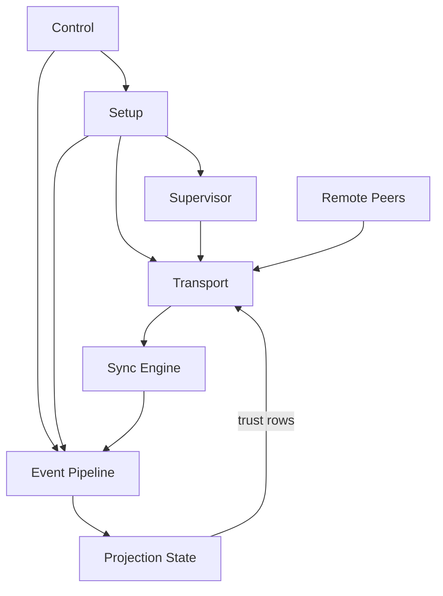

# 🐭 Topo

A proof-of-concept sketch of the (work-in-progress) Topo protocol: an event-sourced, end-to-end encrypted, batteries-included, peer-to-peer backend for building complex applications such as team chat.

Informed by work on [Quiet](https://github.com/TryQuiet); see [Motivation](#Motivation) below for more detail.

TL;DR: 
command 🡪 create event 🡪 sign, encrypt, hash 🡪 peer via QUIC 🡪 check mTLS against event source of truth 🡪 set reconcile 🡪 topo sort 🡪 decrypt 🡪 SQLite 🡪 query

> **🚨 VIBE-CODED & NOT FOR PRODUCTION USE 🚨**

## Quick Start

### Prerequisites

- Rust toolchain (`cargo`, `rustc`)
- SQLite (bundled via `rusqlite` feature in this repo)

### Running the CLI

You can test the proof-of-concept by playing with its CLI either locally, over a LAN (with autodiscovery), or with remote peers.

```bash
cargo run --bin topo -- --help
```

### CLI Preview

Alice creates a workspace and invites Bob, who then accepts:

```text
$ topo --db alice.db start --bind 127.0.0.1:7443
$ topo --db alice.db create-workspace --workspace-name "Activism" --username alice --device-name laptop
$ topo --db alice.db create-invite --public-addr 127.0.0.1:7443
$ topo --db bob.db start --bind 127.0.0.1:7444
$ topo --db bob.db accept-invite --invite "topo://invite/eyJ2IjoxLCJ3b3Jrc3BhY2VfaWQiOiIyZjRhLi4uN2I5MSIsLi4ufQ==" --username bob --devicename phone
```

Later, their conversation might look like:

```text
$ topo --db alice.db view --limit 8

  Activism
    USERS: alice (you), bob
    ACCOUNTS: alice/laptop (you), bob/phone

  ────────────────────────────────────────

    alice [38s ago]
      1. hey bob - welcome to Activism
         🔥 bob

    bob [22s ago]
      2. thanks! invite flow worked first try
         🎉 alice
      3. nice, I can see your file attachment

    alice [18s ago]
      4. File 0
```


### Running Tests

The test suite seeks to prove that the proof-of-concept meets correctness and performance requirements.  

```bash
# Full test suite
cargo test

# Performance tests
cargo test --release --test perf_test -- --nocapture

# Sync graph tests (serial required)
cargo test --release --test sync_graph_test -- --nocapture --test-threads=1

# Low-memory realism/perf matrix
scripts/run_perf_serial.sh lowmem
```

## Architecture

```text
src/
  runtime/               # Daemon control plane, peering loops, transport boundary
  event_modules/         # Event-local commands, queries, wire formats, projectors
  state/                 # SQLite storage, queues, projection apply pipeline
  shared/                # Shared constants/tuning/runtime helpers

tests/
  sync_contract_tests/   # Sync correctness and convergence contracts
  projectors/            # Projector behavior and ordering tests
  *_test.rs              # CLI/RPC/perf/lowmem/system tests

docs/
  DESIGN.md              # Normative design and invariants
  PLAN.md                # Build order and phase gates
  DESIGN_DIAGRAMS.md     # Runtime topology and flow diagrams
  PERF.md                # Benchmarks and perf evidence
```

### High Level Data Flow

See: [DESIGN_DIAGRAMS.md](DESIGN_DIAGRAMS.md) for more.



### TLA+ Model

The proof-of-concept models its DAG and bootstrap transport logic in TLA+. (Probably amateurish, but helpful for avoiding dependency cycles and guiding LLM-driven implementation.)

Core model files:

- `docs/tla/EventGraphSchema.tla`
- `docs/tla/TransportCredentialLifecycle.tla`
- `docs/tla/UnifiedBridge.tla`

Fast TLC checks (uses bundled `docs/tla/tla2tools.jar`):

```bash
cd docs/tla
./tlc event_graph_schema_fast.cfg
./tlc TransportCredentialLifecycle transport_credential_lifecycle_fast.cfg
./tlc UnifiedBridge unified_bridge_progress_fast.cfg
```

## Documentation

- **[docs/DESIGN.md](./docs/DESIGN.md)** - Protocol semantics, runtime invariants, and module ownership boundaries written for (mostly) robots
- **[docs/PLAN.md](./docs/PLAN.md)** - Execution phases, acceptance criteria, and test gates
- **[docs/DESIGN_DIAGRAMS.md](./docs/DESIGN_DIAGRAMS.md)** - Code-accurate runtime/data-flow diagrams
- **[docs/INDEX.md](./docs/INDEX.md)** - Documentation index
- **[docs/PERF.md](./docs/PERF.md)** - Performance results
- **[High-Level Runtime Boundaries Diagram](./docs/DESIGN_DIAGRAMS.md#3-high-level-runtime-boundaries)** - Architecture at a glance


## Motivation

A p2p, FOSS Slack alternative would be huge for user privacy, freedom of expression, and online community resilience / independence. But building one is too hard. We know because we've been trying (see: [Quiet](https://tryquiet.org)).

We think there is a simpler way, one that doesn't:

* lock developers into unrealistically-limited feature sets 
* require they assemble a bricolage of bleeding-edge tools like libp2p, Automerge, MLS, etc.
* handle some of the p2p parts but leave developers on their own for middleware, notifications, etc.
* lead to a nightmare of hard-to-reason-about concurrency problems

This PoC exists to prove the practicality of a principled approach that uses [event sourcing](https://martinfowler.com/eaaDev/EventSourcing.html), [range-based set reconciliation](https://aljoscha-meyer.de/assets/landing/rbsr.pdf),  [topological sort](https://en.wikipedia.org/wiki/Topological_sorting), and [materialization](https://en.wikipedia.org/wiki/Materialized_view) or "projection" of p2p-synced, decrypted events into SQLite tables that can be easily queried by an API.

### What it (seeks to) prove practical

* **SQLite for everything** - You can simplify state management by using SQLite for everything, even file slices, for GBs of messages/files
* **Everything can be an event** - You can model all data, even file slices, as events, encrypt them (and store them all in SQLite)
* **DAG for auth, invites, multi-device, historical key provision** - Complex relationships such as team auth, admin promotion, multi-use Signal-like invite links, signed events, multi-device support, and group key agreement with removal and history-provision can be modeled as events that depend on prior events. (MLS-like TreeKEM schemes can be too, as a complexity-costly enhancement if needed.)
* **Negentropy sync is fast enough for everything** - You can use range-based set reconcilation ("Negentropy" is an implementation name) for syncing all events, whether files, messages, auth, whatever. Large event sets sync fast enough. File downloads are likely network-bound, not IO or CPU-bound.
* **Topological sort makes order not matter** - We can receive data in any order we want because topological sort over large amounts of SQLite events is fast enough that we can block events with missing dependencies and unblock events when their dependencies come in. 
* **DAG can be flexible** - Topo sort also lets the dependency graph fit features like "don't display messages until you know their username" or "display messages immediately with a placeholder username"--this can easily changed by devs and is **NOT** baked into the syncing protocol or document store (as with OrtbitDB, Automerge, etc.--an underappreciated weakness with almost all such tools.)
* **Complex, secure deletion** - It is straightforward to reliably implement things like "delete this message, its attachments, and reactions" or the kind of key purging you'd need for data-layer forward secrecy. 
* **It works in an iOS NSE** - At least, it works on Linux under the 24MB memory limit imposed by iOS on background-wakeup Notification Service Extensions (coming soon, real proof on iOS!)
* **We can use conventional networking primitives** - We can control standard QUIC libraries (e.g. quinn in Rust) sufficiently to initiate mTLS sessions based on peer identity established by our event graph, and route to different workspaces on the same endpoint. We can even do mDNS local discovery and holepunching!
* **No separate STUN/TURN required** - If we need to for product reasons (unclear still, as it may make more sense to rely on cloud nodes or user-community-furnished high availability non-NAT nodes) we can holepunch by aiming QUIC attempts at each other after an in-band introduction signal from a mutually available peer, as opposed to separate protocols/infra for ICE/STUN/TURN.
* **Multitenancy can be built-in** - We can use event sourcing and workspace differentiation via mTLS to make multitenancy a first-class thing, serve many Slack-like workspaces at the same cloud endpoint, and offer multi-account UIs out-of-the-box.
* **Regular (fixed-length) wire formats** - [Langsec](https://langsec.org/) counsels that parsers can be made much more secure when data type complexity is limited, with regular (fixed-length-field) wire formats being the most tractable for secure parsing and formal verification. We keep our wire formats fixed-length.
* **Keys can just be dependencies** - There are no special queues for events with missing signer or decryption keys: these are just declared dependencies (key material is stored in events with id's) and block/unblock accordingly.
* **Realistic testing** - We can run realistic tests locally with deterministic simulation of the event pipeline. Tests can check that for all relevant scenarios, reverse or adversarial reorderings of events and duplicated event replays all will yield the same state.

## Stretch Goal 

A protocol that is simple enough to implement in a weekend project but adequate for building a reliably p2p Slack replacement.

## Status

Not simple enough yet.

## Why "Topo"?

[Topo sort](https://en.wikipedia.org/wiki/Topological_sorting) is something it does a lot. Topo means "mouse" in Italian. We built it for [Quiet](https://tryquiet.org). Mice are quiet ("quiet as a mouse"). 🐭