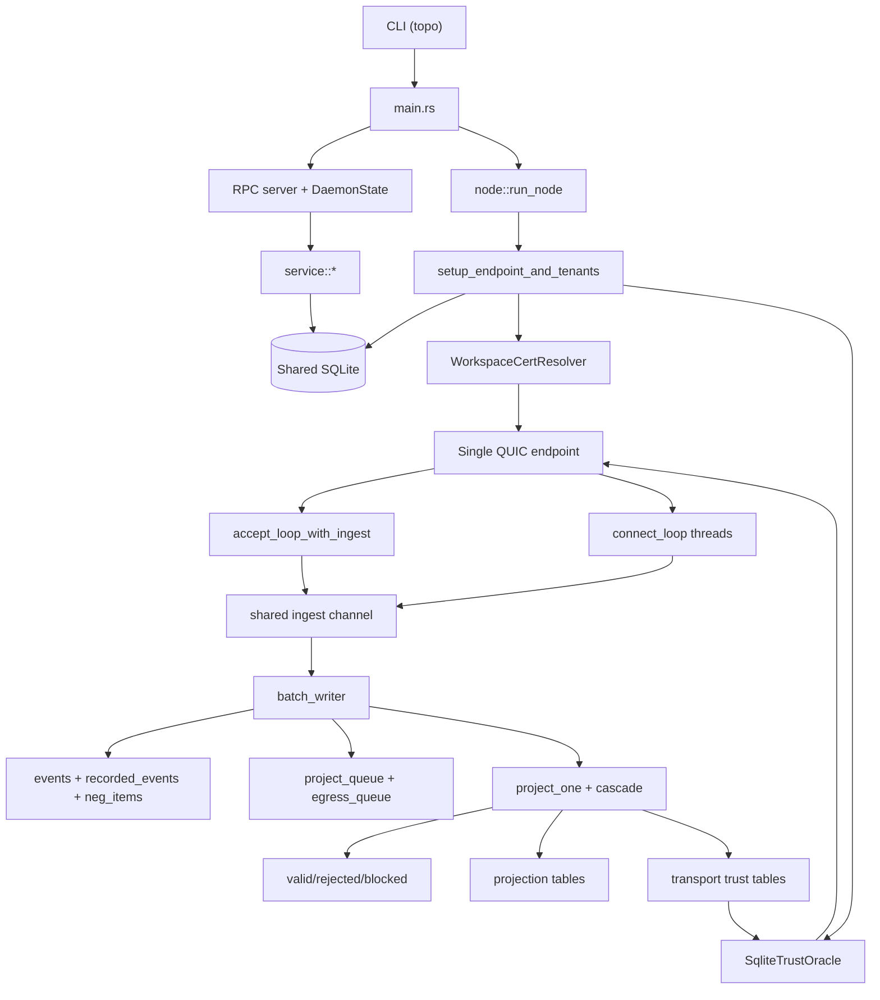
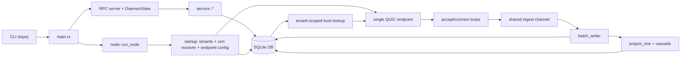
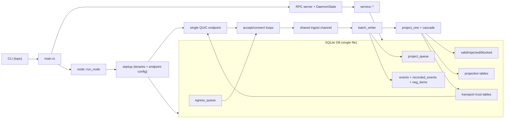
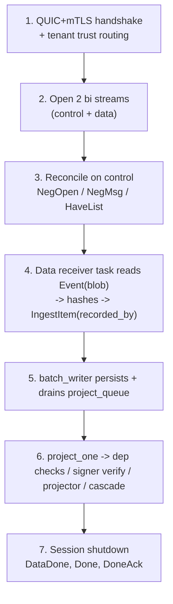
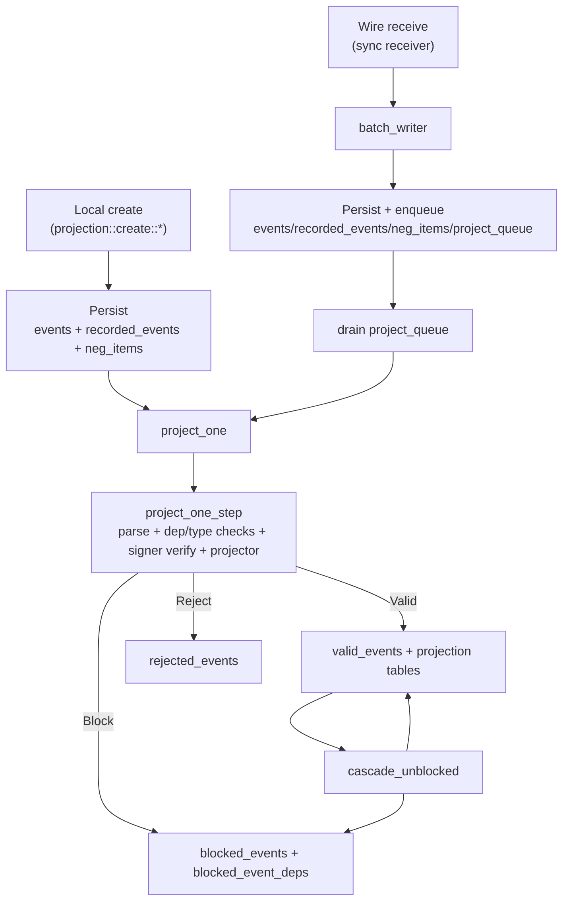

# POC-7 Current Runtime Diagram

This is a code-accurate explainer of the runtime shape in `poc-7` today.
Source modules: `src/node.rs`, `src/peering/runtime/*`, `src/peering/loops/*`, `src/sync/*`, `src/event_pipeline/*`, `src/projection/*`, `src/rpc/*`, `src/db/*`.

## 1) Runtime topology (compact)

## 1b) Runtime topology (SQLite-centered)

## 1c) Runtime topology (SQLite box with internal queues)

## 2) One sync session (compact phases)

## 3) Event ingest + projection convergence (compact)

## Quick explanation script

1. `poc-7` runs one QUIC endpoint and one writer thread per node, even for multiple local tenants.
2. Trust is tenant-scoped in SQL but enforced dynamically during transport handshakes.
3. Both local creates and network receives converge on the same projection entrypoint (`project_one`).
4. Sync uses dual streams (control/data) with explicit shutdown (`DataDone`, `Done`, `DoneAck`).
