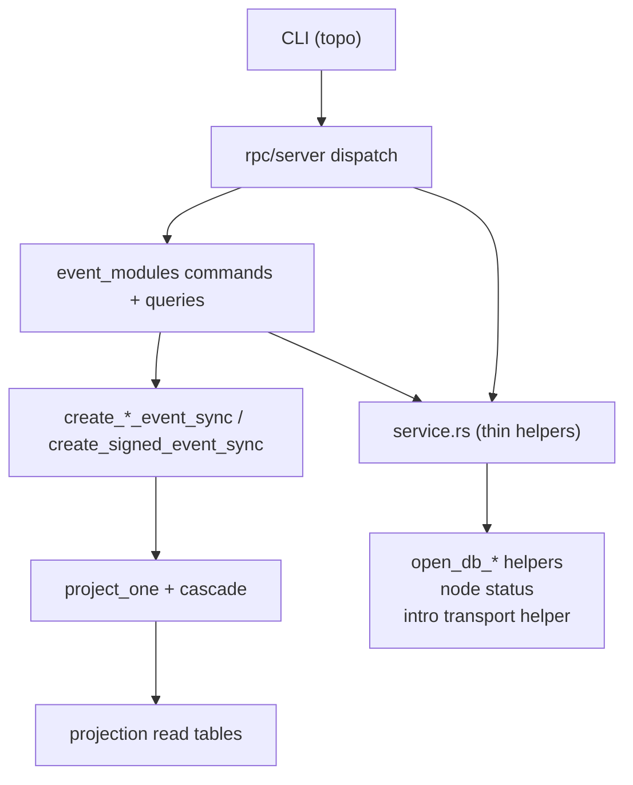
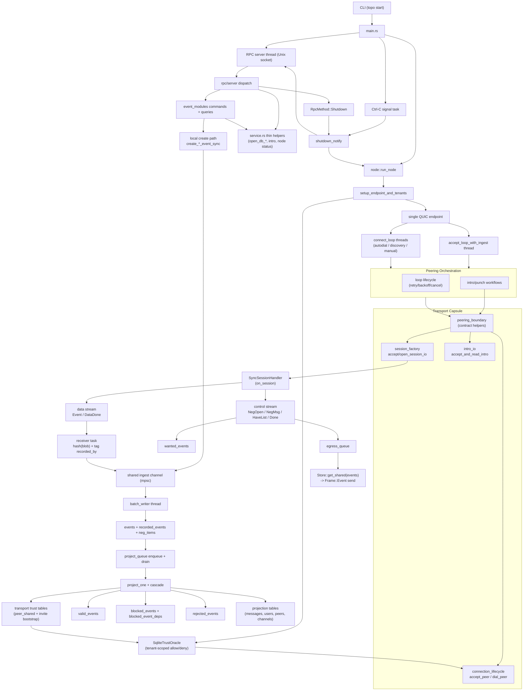
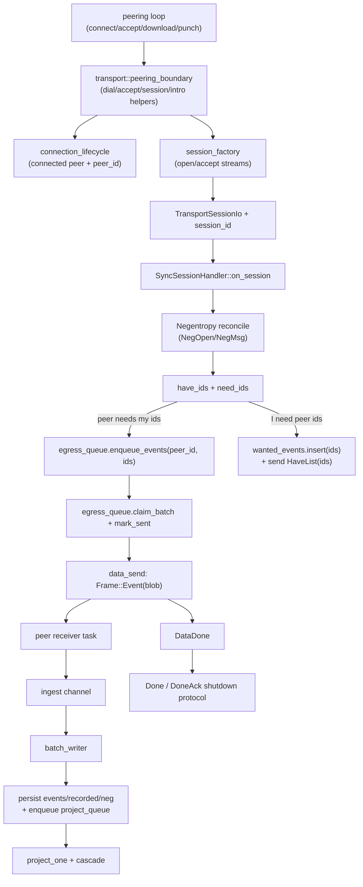
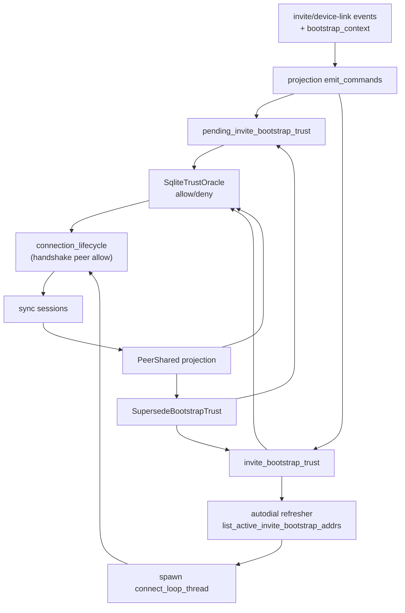
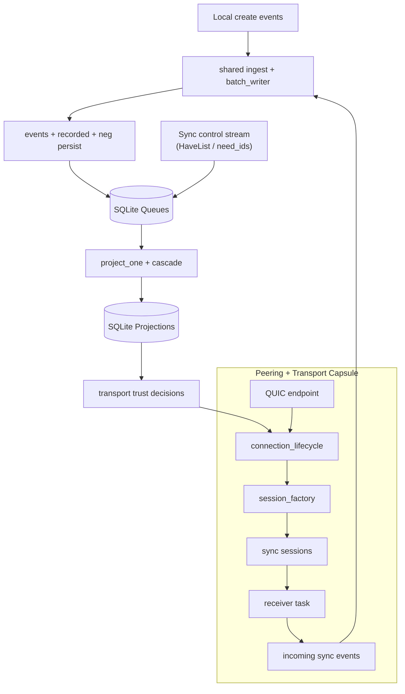
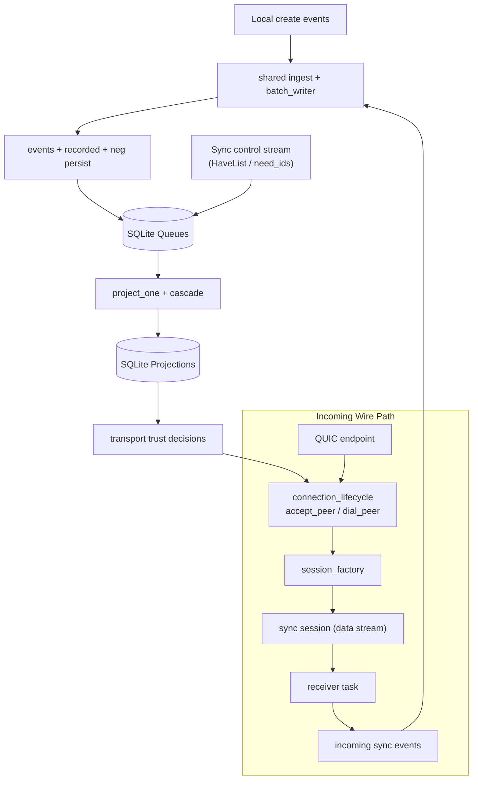
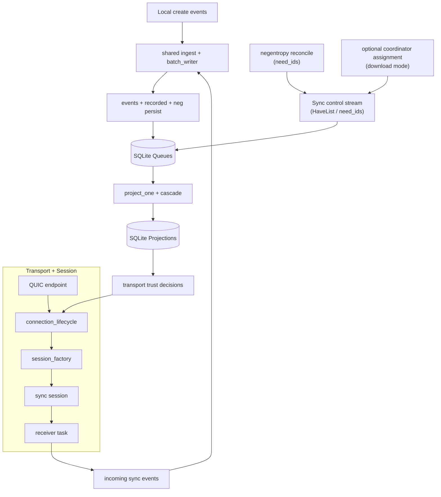
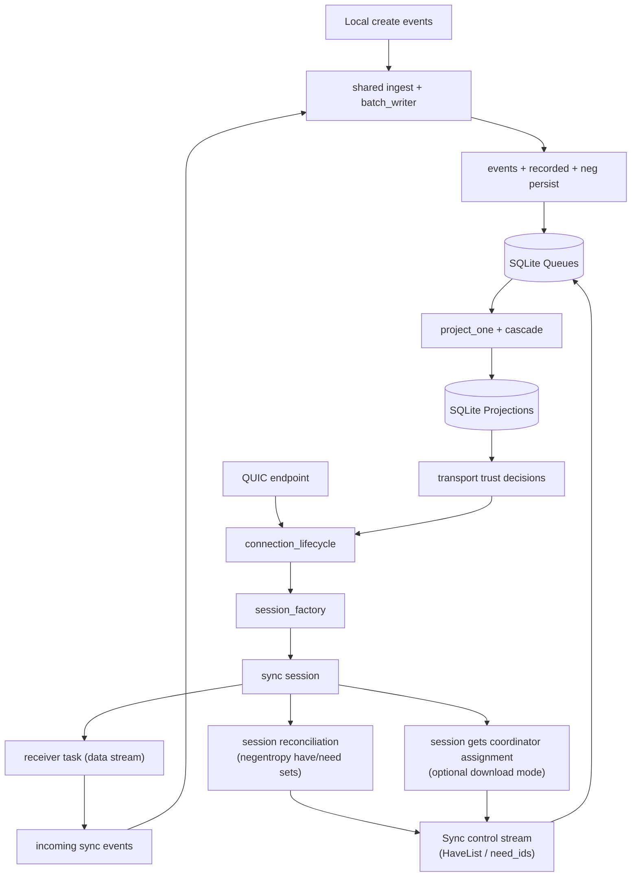

# POC-7 Current Runtime Diagram

Code-accurate runtime and data-flow snapshot for `master` in `poc-7`.

Primary source modules:
- `src/main.rs`
- `src/rpc/server.rs`
- `src/node.rs`
- `src/service.rs`
- `src/event_modules/*/{commands.rs,queries.rs}`
- `src/peering/runtime/*`
- `src/peering/loops/*`
- `src/peering/workflows/*`
- `src/transport/{peering_boundary.rs,connection_lifecycle.rs,session_factory.rs,intro_io.rs}`
- `src/sync/session/*`
- `src/event_pipeline.rs`
- `src/projection/apply/*`
- `src/projection/create.rs`
- `src/db/{project_queue.rs,egress_queue.rs,wanted.rs,transport_trust.rs}`

## 0) RPC Dispatch And Event Locality

## 1) Runtime Topology (Threads + Queues + DB)

## 2) One Sync Session (Control/Data Flow)

## 3) Trust + Bootstrap Autodial Feedback Loop

## 4) Simplified SQLite View (Cylinders)

## 5) Draft: Split Local Create vs Incoming Sync Events

## 6) Draft: Prior Variant (Feedback + Explicit Control Inputs)

## 7) Draft: Control Inputs Produced By Sync Session

## Current Data-Flow Facts

1. `egress_queue` is fed by sync control-plane `HaveList` messages, not by `batch_writer`.
2. `batch_writer` is the shared ingest sink for wire-received events and local-create events; it persists event blobs and drains `project_queue`.
3. RPC command/query dispatch is event-module owned; `service.rs` is now an infra helper layer (`open_db_*`, node status, intro transport helper).
4. Peering orchestration (`connect_loop`/`accept_loop`/workflows) now routes transport operations through `transport::peering_boundary`; peering no longer imports QUIC/trust internals directly.
5. QUIC dial/accept + peer identity extraction are transport-owned in `connection_lifecycle`.
6. QUIC stream wiring (`open_bi`/`accept_bi`, `DualConnection`, `QuicTransportSessionIo`) is transport-owned in `session_factory`.
7. Projection outputs both user-facing read tables and transport trust tables; trust rows feed both handshake allow/deny and bootstrap autodial.
8. `HaveList` IDs originate from negentropy `need_ids` (and optionally coordinator-assigned subsets in download mode), then land in `egress_queue`.
9. Foreground runtime is daemon-first (`topo start`): shutdown is coordinated by shared `shutdown_notify` (RPC `Shutdown` or Ctrl-C).
