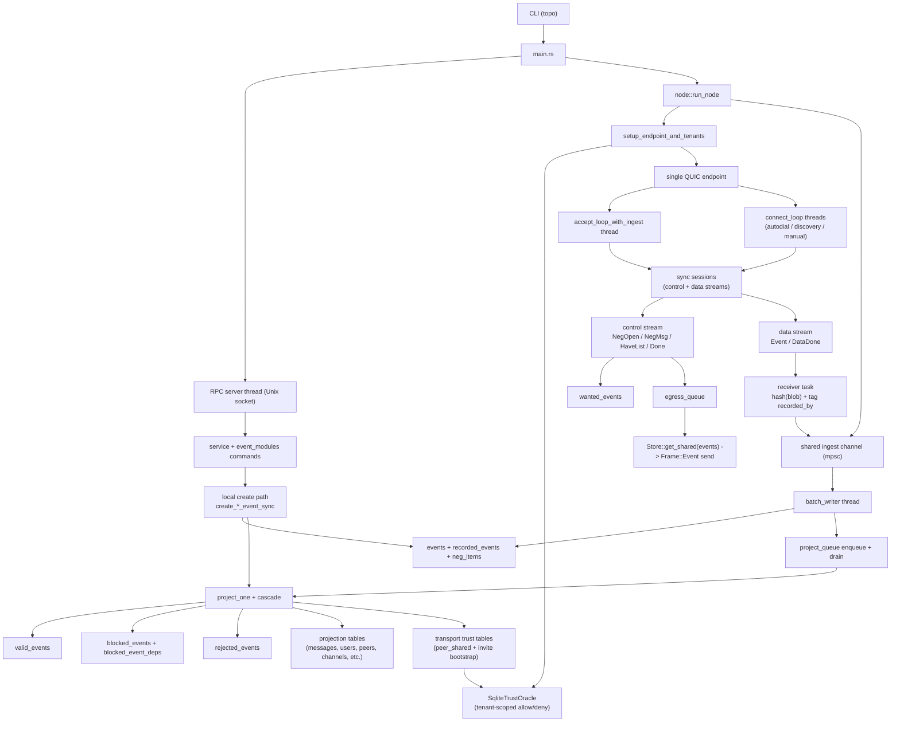
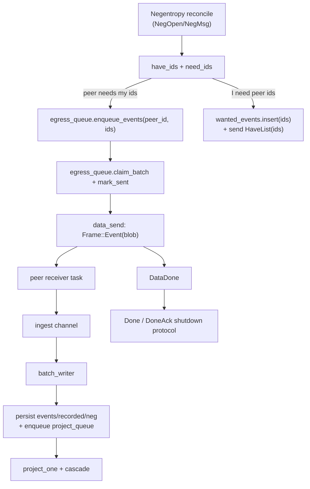
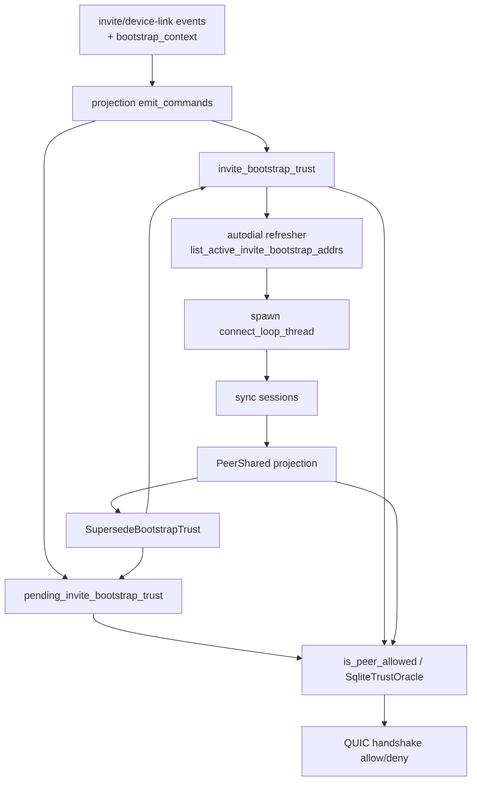
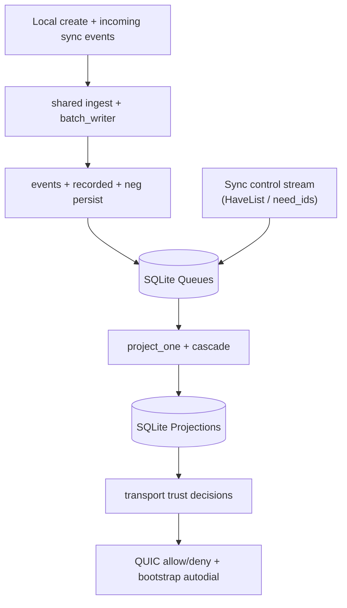
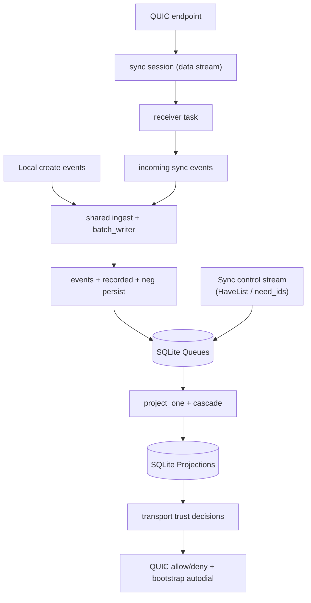
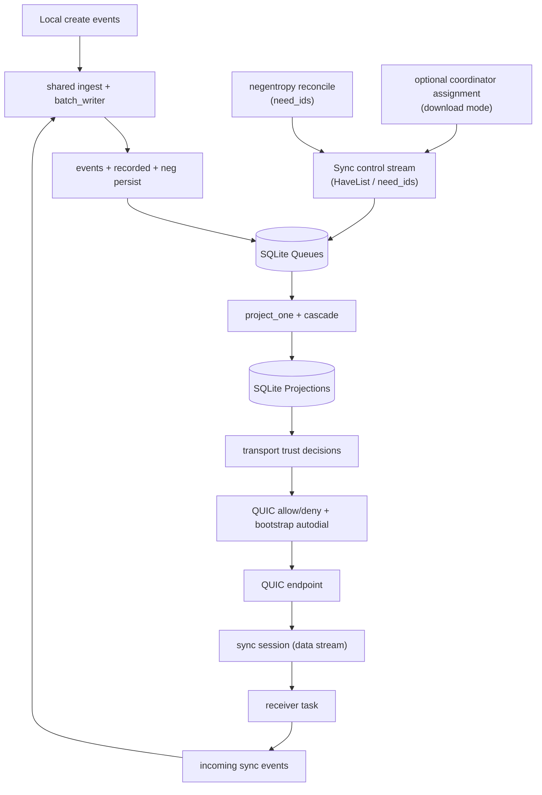
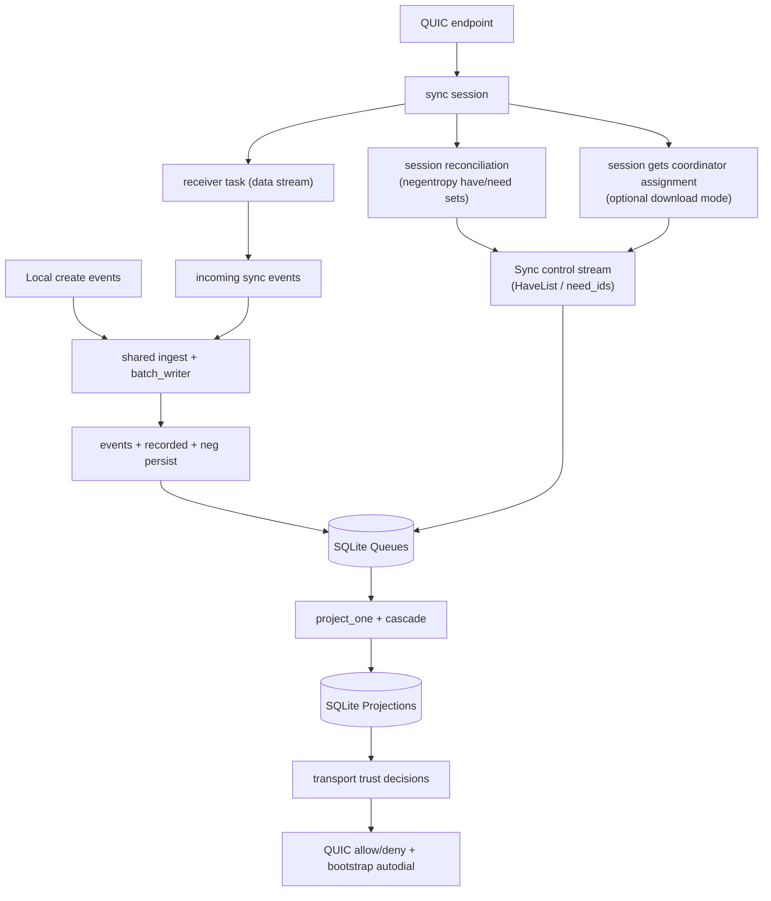

# POC-7 Current Runtime Diagram

Code-accurate runtime and data-flow snapshot for `master` in `poc-7`.

Primary source modules:
- `src/main.rs`
- `src/node.rs`
- `src/peering/runtime/*`
- `src/peering/loops/*`
- `src/sync/session/*`
- `src/event_pipeline.rs`
- `src/projection/apply/*`
- `src/projection/create.rs`
- `src/db/{project_queue.rs,egress_queue.rs,wanted.rs,transport_trust.rs}`

## 1) Runtime Topology (Threads + Queues + DB)

## 2) One Sync Session (Control/Data Flow)

## 3) Trust + Bootstrap Autodial Feedback Loop

## 4) Simplified SQLite View (Cylinders)

## 5) Draft: Split Local Create vs Incoming Sync Events

## 6) Draft: Prior Variant (Feedback + Explicit Control Inputs)

## 7) Draft: Control Inputs Produced By Sync Session

## Current Data-Flow Facts

1. `egress_queue` is fed by sync control-plane `HaveList` messages, not by `batch_writer`.
2. `batch_writer` is the shared ingest sink for wire-received events; it persists event blobs and drains `project_queue`.
3. Local creates (`create_*_event_sync`) and wire receives both converge on `project_one` projection semantics.
4. Projection outputs both user-facing read tables and transport trust tables; trust rows feed both handshake allow/deny and bootstrap autodial.
5. `HaveList` IDs originate from negentropy `need_ids` (and optionally coordinator-assigned subsets in download mode), then land in `egress_queue`.
