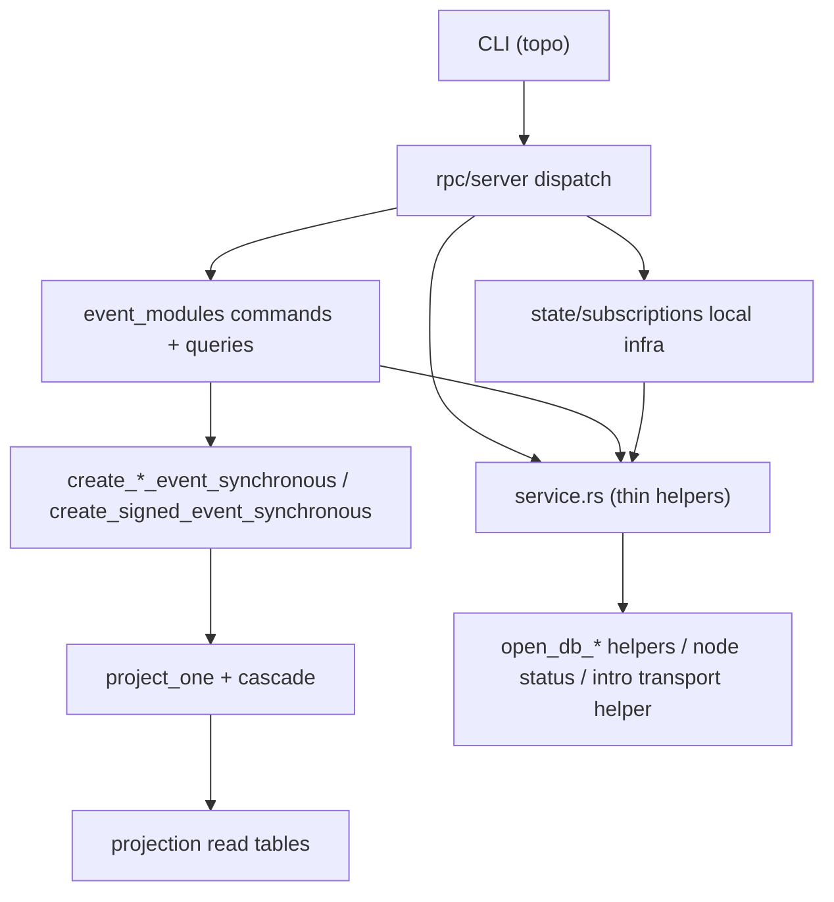
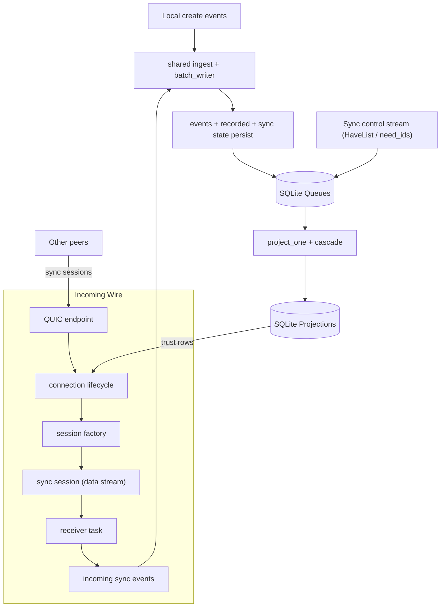
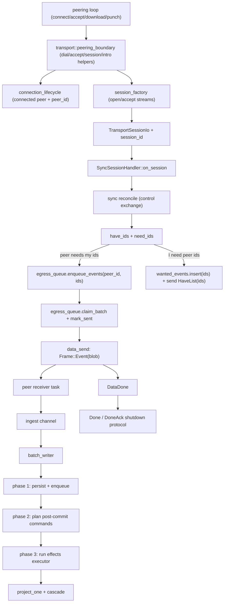
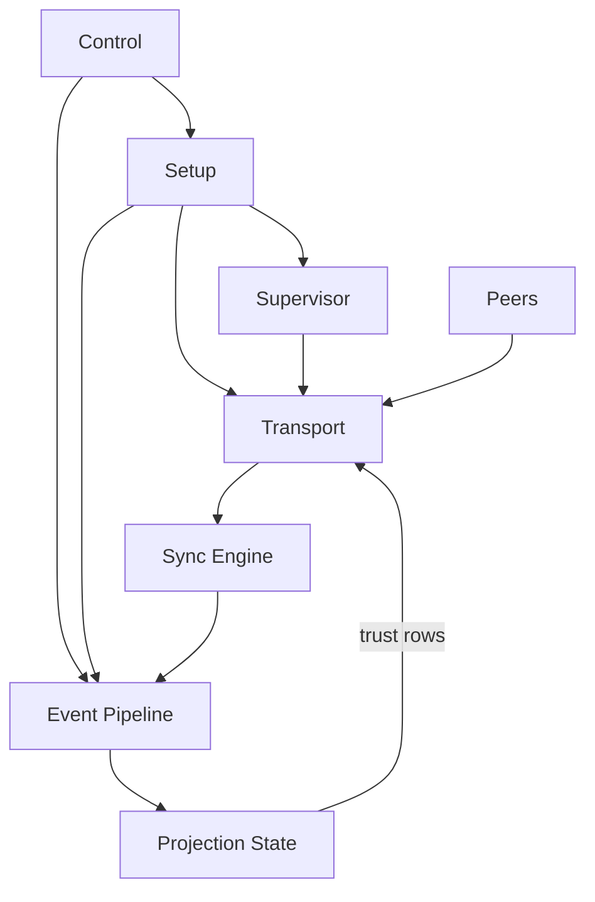
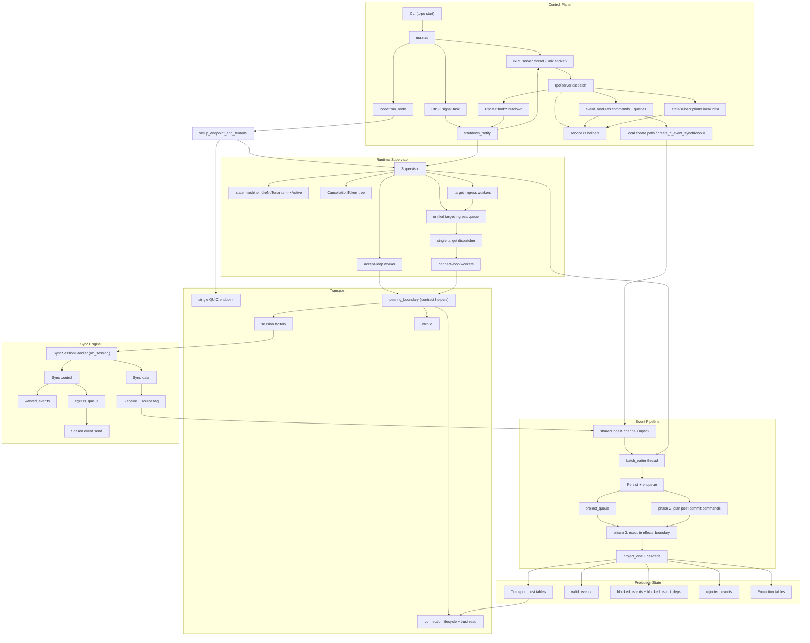
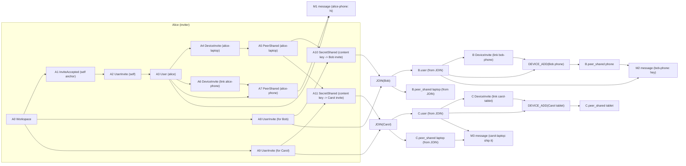
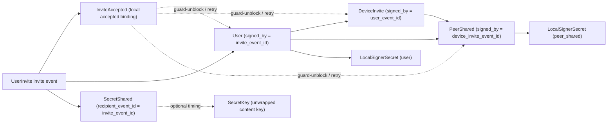
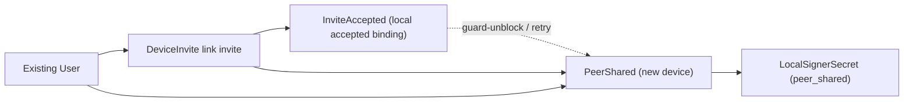
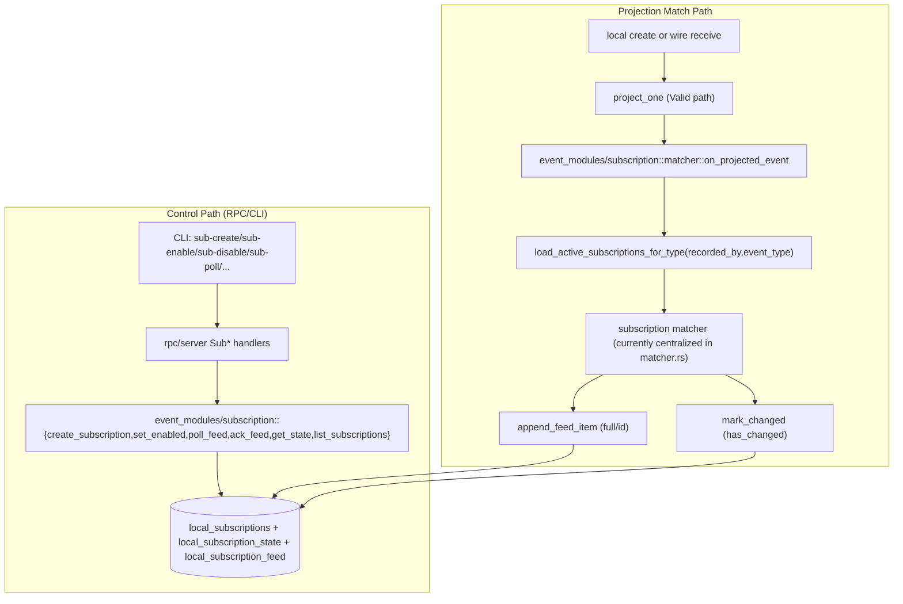
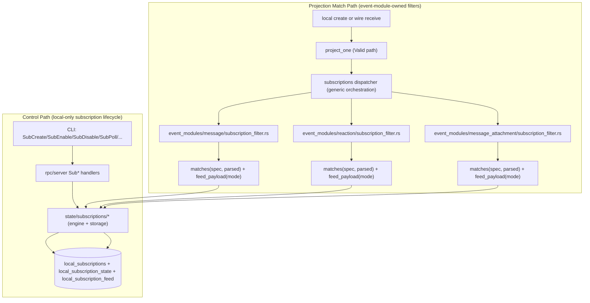

# POC-7 Current Runtime Diagram

Code-accurate runtime and data-flow snapshot for `master` in `poc-7`.

Primary source modules:
- `src/main.rs`
- `src/rpc/server.rs`
- `src/node.rs`
- `src/service.rs`
- `src/event_modules/*/{commands.rs,queries.rs}`
- `src/peering/runtime/*`
- `src/peering/loops/*`
- `src/peering/workflows/*`
- `src/transport/{peering_boundary.rs,connection_lifecycle.rs,session_factory.rs,intro_io.rs}`
- `src/sync/session/*`
- `src/event_pipeline/{mod.rs,phases.rs,planner.rs,effects.rs,drain.rs}`
- `src/projection/apply/*`
- `src/projection/create.rs`
- `src/db/{project_queue.rs,egress_queue.rs,wanted.rs,transport_trust.rs}`

## 0) RPC Dispatch And Event Locality

## 1) Unified Ingest to SQLite (Local + Wire Events)

## 2) One Sync Session (Control/Data Flow)

## 3) High-Level Runtime Boundaries

## 4) Runtime Topology (Threads + Queues + DB, Reference)

**Runtime Topology Legend**
- `runtime::supervisor::RuntimeSupervisor`: single owner for long-lived runtime workers (writer, accept loop, unified target dispatcher, target ingress workers).
- `service.rs helpers`: `open_db_*`, node status helpers, intro transport helper entry points.
- `Persist + enqueue`: phase 1 persists events/recorded/sync state and enqueues `project_queue`.
- `Sync control`: sync control stream messages including `HaveList` and `Done`.
- `Sync data`: sync data stream frames (`Event`, `DataDone`).
- `Shared event send`: `Store::get_shared(events) -> Frame::Event`.
- `Projection tables`: projected read models (`messages`, `users`, `peers`, `channels`).
- `Transport trust tables`: transport trust rows (`peer_shared`, invite bootstrap records).
- `connection lifecycle + trust read`: transport-owned tenant-scoped lookup via `db::transport_trust::is_peer_allowed` plus dial/accept identity handling.

## 5) Bootstrap Event DAG (Alice/Bob/Carol, Multi-device)

Main DAG uses two collapsed repeated blocks to keep repeated invite-accept patterns DRY:
- `JOIN(...)`: expanded in `5.1 User Join Subgraph`.
- `DEVICE_ADD(...)`: expanded in `5.2 Device Add Subgraph`.

### 5.1 User Join Subgraph (expanded)

`workspace::commands::join_workspace_as_new_user` + `persist_join_signer_secrets`.

### 5.2 Device Add Subgraph (expanded)

`workspace::commands::add_device_to_workspace` + `persist_link_signer_secrets`.

## 6) Subscriptions (Before vs After Refactor)

### 6.1 Pre-refactor Flow (historical)

### 6.2 Current Refactored Flow (implemented)

Current ownership intent:
- Event modules own event-specific subscription filter semantics (`subscription_filter` or `subscription_filters` when multiple helpers are needed).
- Subscription lifecycle/storage/feed mechanics remain local infra (non-replicated), outside event-type modules.

## Current Data-Flow Facts

1. `egress_queue` is fed by sync control-plane `HaveList` messages, not by `batch_writer`.
2. `batch_writer` is the shared ingest sink for wire-received events and local-create events; it runs explicit phases: persist transaction, post-commit command planning, and effects execution.
3. RPC command/query dispatch routes to owner modules (event modules for event-domain operations, `state/subscriptions` for local subscription infra); `service.rs` is an infra helper layer (`open_db_*`, node status, intro transport helper).
4. Peering orchestration (`connect_loop`/`accept_loop`/workflows) now routes transport operations through `transport::peering_boundary`; peering no longer imports QUIC/trust internals directly.
5. QUIC dial/accept + peer identity extraction are transport-owned in `connection_lifecycle`.
6. QUIC stream wiring (`open_bi`/`accept_bi`, `DualConnection`, `QuicTransportSessionIo`) is transport-owned in `session_factory`.
7. Projection outputs both user-facing read tables and transport trust tables; trust rows feed both handshake allow/deny and bootstrap autodial.
8. `HaveList` IDs originate from sync reconciliation `need_ids`; runtime initiator sessions use coordinator-assigned subsets (autodial + mDNS), then land in `egress_queue`.
9. Foreground runtime is daemon-first (`topo start`): shutdown is coordinated by shared `shutdown_notify` (RPC `Shutdown` or Ctrl-C).
10. Runtime and helper initiator sessions both route pull assignment through the coordinator; there is no direct `need_ids -> HaveList(all)` bypass path.
11. Transport trust checks now read `db::transport_trust::is_peer_allowed` directly inside transport; the separate trust-oracle adapter layer is removed.
