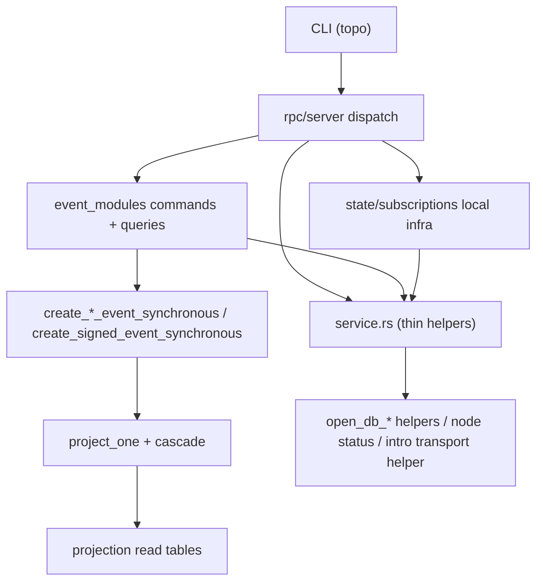
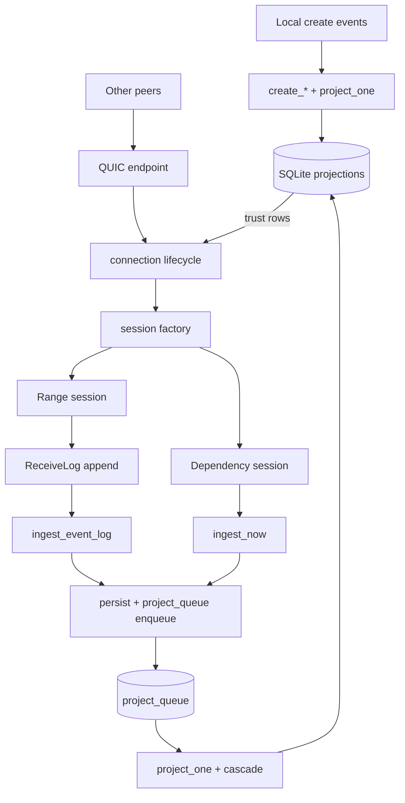
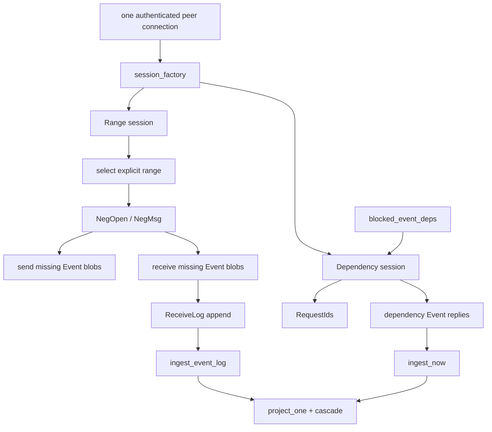
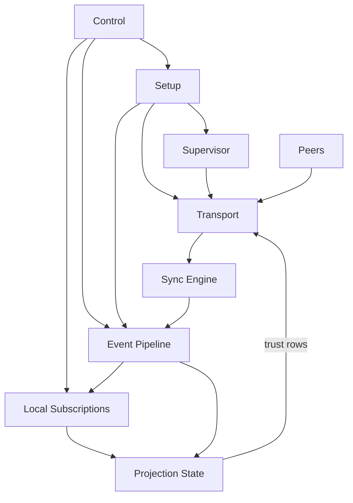
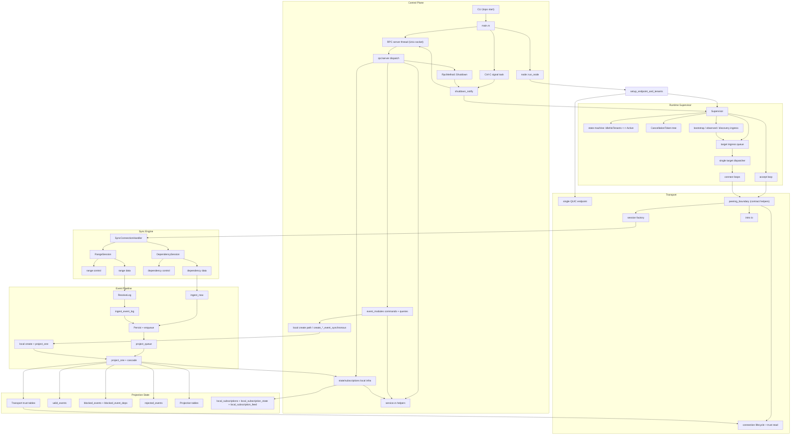
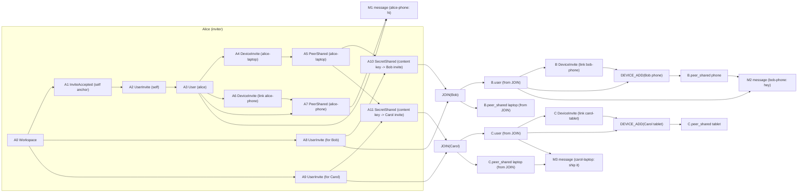
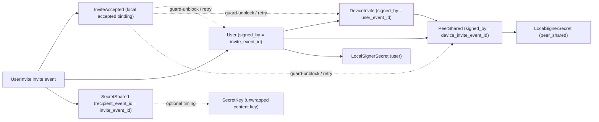
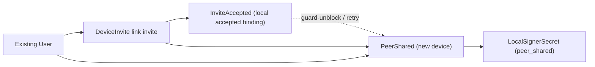

# POC-7 Current Runtime Diagram

Code-accurate runtime and data-flow snapshot for `master` in `poc-7`.

Primary source modules:
- `src/main.rs`
- `src/runtime/control/*`
- `src/node.rs`
- `src/service.rs`
- `src/event_modules/*/{commands.rs,queries.rs}`
- `src/runtime/peering/*`
- `src/runtime/sync_engine/session/*`
- `src/runtime/transport/*`
- `src/state/pipeline/*`
- `src/state/projection/apply/*`
- `src/state/dependency_fetch.rs`
- `src/state/db/{project_queue.rs,transport_trust.rs}`

## 0) RPC Dispatch And Event Locality

```mermaid
flowchart TD
    CLI["CLI (topo)"] --> RPC["rpc/server dispatch"]
    RPC --> EM["event_modules commands + queries"]
    RPC --> SUB["state/subscriptions local infra"]
    RPC --> SVC["service.rs (thin helpers)"]

    EM --> SVC
    EM --> CREATE["create_*_event_synchronous / create_signed_event_synchronous"]
    SUB --> SVC
    CREATE --> PROJ["project_one + cascade"]
    PROJ --> READS["projection read tables"]

    SVC --> INFRA["open_db_* helpers / node status / intro transport helper"]
```

## 1) Unified Ingest to SQLite (Local + Wire Events)

```mermaid
flowchart TD
    LOCAL["Local create events"] --> CREATE["create_* + project_one"]
    CREATE --> PDB[("SQLite projections")]

    OTHERS["Other peers"] --> EP["QUIC endpoint"]
    EP --> LIFE["connection lifecycle"]
    LIFE --> FACT["session factory"]
    FACT --> RANGE["Range session"]
    FACT --> DEP["Dependency session"]

    RANGE --> LOG["ReceiveLog append"]
    LOG --> INGEST["ingest_event_log"]
    DEP --> NOW["ingest_now"]

    INGEST --> STORE["persist + project_queue enqueue"]
    NOW --> STORE
    STORE --> QDB[("project_queue")]
    QDB --> APPLY["project_one + cascade"]
    APPLY --> PDB

    PDB -->|trust rows| LIFE
```

## 2) One Sync Session (Control/Data Flow)

```mermaid
flowchart TD
    PEER["one authenticated peer connection"] --> FACT["session_factory"]

    FACT --> RANGE["Range session"]
    RANGE --> WIN["select explicit range"]
    WIN --> NEG["NegOpen / NegMsg"]
    NEG --> SEND["send missing Event blobs"]
    NEG --> RECV["receive missing Event blobs"]
    RECV --> LOG["ReceiveLog append"]
    LOG --> INGEST["ingest_event_log"]
    INGEST --> PROJ["project_one + cascade"]

    FACT --> DEP["Dependency session"]
    BLOCKED["blocked_event_deps"] --> DEP
    DEP --> REQ["RequestIds"]
    DEP --> REPLY["dependency Event replies"]
    REPLY --> NOW["ingest_now"]
    NOW --> PROJ
```

## 3) High-Level Runtime Boundaries

```mermaid
%%{init: {"flowchart": {"wrappingWidth": 320}} }%%
flowchart TD
    CTRL["Control"]
    BOOT["Setup"]
    RSUP["Supervisor"]
    TRANS["Transport"]
    SYNC["Sync Engine"]
    PIPE["Event Pipeline"]
    SUBS["Local Subscriptions"]
    PSTATE["Projection State"]
    PEERS["Peers"]

    CTRL --> BOOT
    CTRL --> PIPE
    CTRL --> SUBS
    BOOT --> RSUP
    BOOT --> TRANS
    BOOT --> PIPE
    RSUP --> TRANS
    PEERS --> TRANS
    TRANS --> SYNC
    SYNC --> PIPE
    PIPE --> SUBS
    SUBS --> PSTATE
    PIPE --> PSTATE
    PSTATE -->|trust rows| TRANS
```

## 4) Runtime Topology (Threads + Queues + DB, Reference)

```mermaid
%%{init: {"flowchart": {"wrappingWidth": 340}} }%%
flowchart TD
    subgraph CTRL["Control Plane"]
      CLI["CLI (topo start)"] --> MAIN["main.rs"]
      MAIN --> RPC["RPC server thread (Unix socket)"]
      MAIN --> NODE["node::run_node"]
      MAIN --> SIG["Ctrl-C signal task"]
      SIG --> SHUT_N["shutdown_notify"]

      RPC --> DISPATCH["rpc/server dispatch"]
      DISPATCH --> SHUT_REQ["RpcMethod::Shutdown"]
      SHUT_REQ --> SHUT_N
      DISPATCH --> EMQ["event_modules commands + queries"]
      DISPATCH --> SUBQ["state/subscriptions local infra"]
      DISPATCH --> SVC["service.rs helpers"]
      EMQ --> SVC
      SUBQ --> SVC
      EMQ --> LOCAL["local create path / create_*_event_synchronous"]
    end

    START["setup_endpoint_and_tenants"]

    subgraph RUNTIME_SUP["Runtime Supervisor"]
      RSUP["Supervisor"]
      RSTATE["state machine: IdleNoTenants <-> Active"]
      RCANCEL["CancellationToken tree"]
      TARGET_Q["target ingress queue"]
      DISPATCHER["single target dispatcher"]
      ACCEPT_W["accept loop"]
      CONNECT_W["connect loops"]
      INGRESS_W["bootstrap / observed / discovery ingress"]
      RSUP --> RSTATE
      RSUP --> RCANCEL
      RSUP --> ACCEPT_W
      RSUP --> INGRESS_W
      RSUP --> TARGET_Q
      TARGET_Q --> DISPATCHER
      DISPATCHER --> CONNECT_W
      INGRESS_W --> TARGET_Q
    end

    NODE --> START
    START --> RSUP

    subgraph PIPE["Event Pipeline"]
      LOCAL --> LOCAL_PROJ["local create + project_one"]
      RANGE_LOG["ReceiveLog"] --> LOG_INGEST["ingest_event_log"]
      DEP_INGEST["ingest_now"] --> P1["Persist + enqueue"]
      LOG_INGEST --> P1
      P1 --> PROJ_Q["project_queue"]
      PROJ_Q --> PROJ["project_one + cascade"]
      LOCAL_PROJ --> PROJ
    end

    subgraph TRANS["Transport"]
      direction LR
      EP["single QUIC endpoint"]
      BOUND["peering_boundary (contract helpers)"]
      LIFE["connection lifecycle + trust read"]
      FACT["session factory"]
      IIO["intro io"]
    end

    START --> EP
    ACCEPT_W --> BOUND
    CONNECT_W --> BOUND
    BOUND --> LIFE
    BOUND --> FACT
    BOUND --> IIO

    subgraph SYNC_ENG["Sync Engine"]
      SYNC["SyncConnectionHandler"]
      RANGE_SESS["RangeSession"]
      DEP_SESS["DependencySession"]
      RANGE_CTRL["range control"]
      RANGE_DATA["range data"]
      DEP_CTRL["dependency control"]
      DEP_DATA["dependency data"]

      SYNC --> RANGE_SESS
      SYNC --> DEP_SESS
      RANGE_SESS --> RANGE_CTRL
      RANGE_SESS --> RANGE_DATA
      DEP_SESS --> DEP_CTRL
      DEP_SESS --> DEP_DATA
    end

    FACT --> SYNC
    RANGE_DATA --> RANGE_LOG
    DEP_DATA --> DEP_INGEST

    subgraph PSTATE["Projection State"]
      direction LR
      TRUST_DB["Transport trust tables"]
      VALID["valid_events"]
      BLOCKED["blocked_events + blocked_event_deps"]
      REJECTED["rejected_events"]
      READS["Projection tables"]
      SUB_DB["local_subscriptions + local_subscription_state + local_subscription_feed"]
    end

    PROJ --> VALID
    PROJ --> BLOCKED
    PROJ --> REJECTED
    PROJ --> READS
    PROJ --> SUBQ
    PROJ --> TRUST_DB
    SUBQ --> SUB_DB

    TRUST_DB --> LIFE
    SHUT_N --> RSUP
    SHUT_N --> RPC
```

**Runtime Topology Legend**
- `runtime::supervisor::RuntimeSupervisor`: single owner for long-lived runtime workers (accept loop, unified target dispatcher, target ingress workers).
- `service.rs helpers`: `open_db_*`, node status helpers, intro transport helper entry points.
- `Persist + enqueue`: phase 1 persists events/recorded/sync state and enqueues `project_queue`.
- `Range session`: one explicit range, one reconcile phase, one bulk transfer phase.
- `Dependency session`: long-lived blocker-repair path using `RequestIds` plus `Event` replies.
- `Shared event send`: `Store::get_shared(events) -> Frame::Event`.
- `Projection tables`: projected read models (`messages`, `users`, `peers`, `channels`).
- `Transport trust tables`: transport trust rows (`peer_shared`, invite bootstrap records).
- `connection lifecycle + trust read`: transport-owned tenant-scoped lookup via `db::transport_trust::is_authorized_for_tenant` plus dial/accept identity handling.

## 5) Bootstrap Event DAG (Alice/Bob/Carol, Multi-device)

Main DAG uses two collapsed repeated blocks to keep repeated invite-accept patterns DRY:
- `JOIN(...)`: expanded in `5.1 User Join Subgraph`.
- `DEVICE_ADD(...)`: expanded in `5.2 Device Add Subgraph`.

```mermaid
flowchart LR
    subgraph A["Alice (inviter)"]
      A0["A0 Workspace"]
      A1["A1 InviteAccepted (self anchor)"]
      A2["A2 UserInvite (self)"]
      A3["A3 User (alice)"]
      A4["A4 DeviceInvite (alice-laptop)"]
      A5["A5 PeerShared (alice-laptop)"]
      A6["A6 DeviceInvite (link alice-phone)"]
      A7["A7 PeerShared (alice-phone)"]
      A8["A8 UserInvite (for Bob)"]
      A9["A9 UserInvite (for Carol)"]
      A10["A10 SecretShared (content key -> Bob invite)"]
      A11["A11 SecretShared (content key -> Carol invite)"]
    end

    A0 --> A1 --> A2 --> A3 --> A4 --> A5
    A3 --> A6 --> A7
    A3 --> A7
    A0 --> A8
    A0 --> A9
    A8 --> A10
    A9 --> A11
    A5 --> A10
    A5 --> A11

    BJ["JOIN(Bob)"]
    CJ["JOIN(Carol)"]
    A8 --> BJ
    A10 --> BJ
    A9 --> CJ
    A11 --> CJ

    BUSER["B.user (from JOIN)"]
    BPSL["B.peer_shared laptop (from JOIN)"]
    CUSER["C.user (from JOIN)"]
    CPSL["C.peer_shared laptop (from JOIN)"]
    BJ --> BUSER
    BJ --> BPSL
    CJ --> CUSER
    CJ --> CPSL

    BDI["B DeviceInvite (link bob-phone)"]
    CDI["C DeviceInvite (link carol-tablet)"]
    BUSER --> BDI
    CUSER --> CDI

    BADD["DEVICE_ADD(Bob phone)"]
    CADD["DEVICE_ADD(Carol tablet)"]
    BDI --> BADD
    CDI --> CADD
    BUSER --> BADD
    CUSER --> CADD

    BPSP["B.peer_shared phone"]
    CPST["C.peer_shared tablet"]
    BADD --> BPSP
    CADD --> CPST

    M1["M1 message (alice-phone: hi)"]
    M2["M2 message (bob-phone: hey)"]
    M3["M3 message (carol-laptop: ship it)"]

    A3 --> M1
    A7 --> M1
    BUSER --> M2
    BPSP --> M2
    CUSER --> M3
    CPSL --> M3
```

### 5.1 User Join Subgraph (expanded)

`workspace::commands::join_workspace_as_new_user` + `persist_join_signer_secrets`.

```mermaid
flowchart LR
    INV["UserInvite invite event"] --> IA["InviteAccepted (local accepted binding)"]
    INV --> UB["User (signed_by = invite_event_id)"]
    UB --> DIF["DeviceInvite (signed_by = user_event_id)"]
    DIF --> PSF["PeerShared (signed_by = device_invite_event_id)"]
    UB --> PSF

    INV --> SS["SecretShared (recipient_event_id = invite_event_id)"]
    SS -. optional timing .-> SK["SecretKey (unwrapped content key)"]

    PSF --> LSP["LocalSignerSecret (peer_shared)"]
    UB --> LSU["LocalSignerSecret (user)"]

    IA -. guard-unblock / retry .-> UB
    IA -. guard-unblock / retry .-> DIF
    IA -. guard-unblock / retry .-> PSF
```

### 5.2 Device Add Subgraph (expanded)

`workspace::commands::add_device_to_workspace` + `persist_link_signer_secrets`.

```mermaid
flowchart LR
    USER["Existing User"] --> DINV["DeviceInvite link invite"]
    DINV --> IA["InviteAccepted (local accepted binding)"]
    DINV --> PSF["PeerShared (new device)"]
    USER --> PSF
    PSF --> LSP["LocalSignerSecret (peer_shared)"]
    IA -. guard-unblock / retry .-> PSF
```

## Current Data-Flow Facts

1. bulk sync is range-owned and writes to `ReceiveLog`, not a shared ingest channel.
2. dependency repair is a separate session class and ingests replies immediately with `ingest_now`.
3. the active bulk path does not use durable `wanted`, request-credit, or `ResponseCredit`.
4. RPC command/query dispatch still routes to owner modules; `service.rs` remains an infra helper layer.
5. Peering orchestration (`connect_loop` / `accept_loop` / workflows) routes transport operations through `transport::peering_boundary`; peering does not own QUIC/trust internals directly.
6. QUIC dial/accept plus peer identity extraction are transport-owned in `connection_lifecycle`.
7. QUIC stream wiring is transport-owned in `session_factory`.
8. Projection outputs both user-facing read tables and transport trust tables; trust rows still feed handshake allow/deny and bootstrap autodial.
9. Foreground runtime is daemon-first (`topo start`): shutdown is coordinated by shared `shutdown_notify` (RPC `Shutdown` or Ctrl-C).
10. Transport trust checks read `db::transport_trust::is_authorized_for_tenant` directly inside transport.
