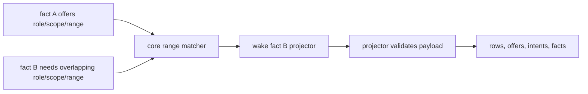
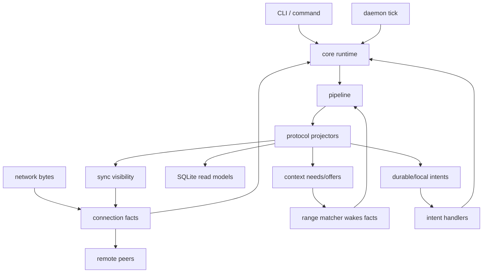

<!-- _class: lead -->

# Context

## Can building p2p collaboration tools be made easier by making context explicit?

---

# Why is building useful p2p apps so hard?

<!-- pt:incremental_lists: true -->

- Many problems to solve: p2p, e2ee, sync, files, push etc.
- Solutions aren't generic; must fit product needs
- Concurrency is the hard part: races, partial knowledge, retry, local state, and network state all interact.

---

# Can't we just use existing approaches?

<!-- pt:incremental_lists: true -->

* There's BitTorrent, Git, libp2p, IPFS, SSB, Briar, Nostr, Signal, Tor...*Somebody* must have figured this stuff out! 
* Right?
* ...right?
* ... 

---

# Our experience with existing p2p tools

<!-- pt:incremental_lists: true -->

- They cover *some* of our needed stack
- But what they *do* cover is costly to adapt to product goals
- And *uncovered* areas sprout concurrency problems, heisenbugs

<span style="color: #fb4934">Result: easy features are super hard, hard features are out of reach.</span>

---

# Specific gripes with existing p2p tools

<!-- pt:incremental_lists: true -->

- **Dependency-only data models** - exact prerequisites are not enough; products also need range context, future context, and contextual proof
- **No iOS support** - especially for push & the iOS NSE memory limit
- **No multi-tenant/account support** - so you'll need to roll a lot of your own infra to support mobile devices and notifications
- **No simple API for frontends** - you must build a complex middle layer to cover all the queries your frontend needs

(**p2panda** is a lot better than others, but those last three gripes apply there too)

---

# Context proposes a better way

Instead of providing lots of features for *parts* of the problem, it focuses on covering

<!-- pt:incremental_lists: true -->

- **All layers**: everything from networking to the local app API.
- **Most deployment contexts**: everything from iOS notification fetching to multi-tenant servers. (Soon the web, too.)
- **Protocol context**: facts offer context to other facts, and those relationships drive deterministic progress.

...in a principled solution to the hard problem, **concurrency**.

---

# Context makes your backend simpler

<!-- pt:incremental_lists: true -->

- Uses SQLite to stay memory-bounded so **no separate backend for iOS**
- One endpoint can host many tenants so **no separate infra for cloud** 
- SQLite contains all state including files; **no OS filesystem quirks**
- Context relationships can be exact facts, fact ranges, or offers waiting for future facts
- End-to-end testing is cheap and easy
- You get a flexible, concurrency-safe way to do encryption and auth

You model durable facts and the context they offer, rather than building a custom state machine for every product edge case.

---

# Context makes your frontend simpler

<!-- pt:incremental_lists: true -->

- Facts turn into SQLite tables so **data can have whatever shape it wants**
- The API can answer complex queries like "give me a paginated message list with usernames, reactions, attachments, and download progress" so **you don't need a middle layer**
- A local `client_op_id` can return with later-updated facts, so **you don't need a custom sync state machine for optimistic updates**
- Frontends can get subscription feeds of changes and poll for the latest state, so **frontend state management is easy.**

This makes P2P frontend development *easier* than centralized apps (less frontend state)

---

# Context tames concurrency

<!-- pt:incremental_lists: true -->

- **Data** including files and who to connect to is represented as immutable facts
- **Context needs/offers** express exact and range relationships between facts
- Connection, sync, and auth are facts too, not side channels with separate concurrency rules
- **Sync** ensures peers converge on shared facts and the context needed to project them
- **Projectors** decrypt, validate, and write facts into easily queried tables
- **State and auth** are derived deterministically from the fact set
- **Secrets** are facts that offer key coverage context to encrypted facts

This way, devs can think about facts, context, and converging sets, **not concurrency**.

---

# How context needs/offers work

<!-- pt:incremental_lists: true -->

- A fact's projector emits the complete current set of **needs** and **offers** for that fact
- A need is a role, scope, and byte range; an offer is the same shape
- Core wakes a fact when a need range overlaps an offer range
- The consuming projector still validates the matched payload before writing rows or emitting follow-up work
- Offers can exist before the facts that will need them, which makes context more general than blocking



---

# Runtime Loop



---

# Result: easy stuff gets easy again. 

And hard stuff stays possible.

Next, a demo

---

# Demo

* Create, invite, message, react, attach a file
* Link a device
* Fact, context, and sync logs
* Multitenancy in action

**Won't demo:** subscriptions, holepunching, mDNS discovery, multi-source sync.


<!-- Scraps

# TL;DR:

**Most p2p stacks** offer lots of features that aren't what you need; you're on your own in a hard battle with concurrency.

**Context** covers the concurrency problem; features are up to you.


# An observation 💡

Given that:

<!-- pt:incremental_lists: true 

* data, auth, syncing, and peering must be tailored to product needs
* all p2p libraries (except perhaps libp2p) are at very early stages of maturity
* this stuff is hard

...Maybe p2p library features are ~useless?

Instead, maybe what you need is a **concurrency approach** covering the whole problem.

-->

---

<!-- _class: lead -->

# Performance Benchmarks

(All scores are from a fast desktop: AMD Ryzen AI MAX+ 395 (16c/32t) · 122 GiB RAM · SQLite WAL · Rust `--release`)

---

# Fact Sync Throughput

Peer-to-peer QUIC sync over localhost with negentropy reconciliation (daemon-based, warm start).

| Test | Facts | Wall Time | Msgs/s | Peak VmHWM |
|------|-------:|----------:|-------:|-----------:|
| 10k bidirectional (5k each) | 10,000 | 2.37s | 4,211 | 70.4 MiB |
| 50k one-way | 50,000 | 16.13s | 3,100 | 131.2 MiB |
| 10k continuous inject | 10,000 | 1.85s | 5,412 | 66.6 MiB |


* *continuous inject* means facts injected while sync is running
* Maybe not network-bound on a fast network and slow device, but fast enough

---

# Realistic Network Sync (2k bidirectional)

Same QUIC sync, but through a UDP traffic shaper modelling link conditions
(bandwidth cap, latency, jitter, packet loss). The matrix mixes WAN-style
profiles with optimistic short-range Wi-Fi / Bluetooth / BLE ceiling profiles
for nearby peers on clean links.

| Profile | Bandwidth | RTT | Loss | Wall Time | Msgs/s | Peak VmHWM |
|---------|----------:|----:|-----:|----------:|-------:|-----------:|
| Wi-Fi Max | 150 Mbps | 8ms | 0.1% | 0.82s | 2,430 | 26.0 MiB |
| Bluetooth Max | 2.1 Mbps | 20ms | 0.2% | 10.34s | 193 | 29.4 MiB |
| BLE Max | 1.4 Mbps | 18ms | 0.1% | 15.34s | 130 | 26.8 MiB |
| Cable | 35 Mbps | 24ms | 0.2% | 1.17s | 1,714 | 25.8 MiB |
| DSL | 3 Mbps | 44ms | 0.3% | 7.69s | 260 | 27.1 MiB |
| Mobile | 15 Mbps | 80ms | 0.8% | 5.72s | 349 | 25.8 MiB |
| Slow Mobile | 2 Mbps | 140ms | 1.5% | 19.63s | 102 | 24.1 MiB |
| Starlink | 15 Mbps | 70ms | 0.5% | 3.24s | 617 | 25.2 MiB |

- All eight profiles complete successfully, from optimistic short-range Wi-Fi through degraded slow mobile
- The short-range ceiling references behave as expected: Wi-Fi is fast enough to expose protocol overhead, while Bluetooth and BLE stay throughput-bound
- Memory stays roughly flat in the mid-20 MiB range across the matrix, with no protocol-driven memory blowup

---

# Live Message Delivery Latency

Round-based discovery latency. 2 msg/s × 15 s, in-process loopback, no preload.

| Discovery mode | avg | p50 | p95 | worst |
|----------------|-----|-----|-----|-------|
| negentropy only (5 s rounds) | 2,561 ms | 2,805 ms | 4,813 ms | 4,833 ms |

- Negentropy avg ≈ half the round gap (~2.5 s at 5 s rounds) — expected
- Gate assertion: worst ≤ 5 s at 2 msg/s (actual: 4,833 ms)

---

# Delivery Latency by Rate (forward-on-have)

| Rate | Duration | avg | p50 | p95 | worst |
|------|----------|-----|-----|-----|-------|
| 1 msg/s | 5s | 2.0 ms | 2 ms | 3 ms | 3 ms |
| 2 msg/s | 15s | 2.4 ms | 2 ms | 4 ms | 4 ms |
| 4 msg/s | 20s | 3.2 ms | 3 ms | 5 ms | 8 ms |
| 10 msg/s | 20s | 2.9 ms | 3 ms | 4 ms | 5 ms |

- Rate has negligible effect — bottleneck is QUIC loopback RTT (~2 ms)

---

# File Attachment Throughput

Local encode + store + project for 256 KiB ciphertext slices (no sync).

| Size | Slices | Wall Time | MB/s | Slices/s |
|-----:|-------:|----------:|-----:|---------:|
| 256 KiB | 1 | 0.001s | 185.6 | 742 |
| 10 MB | 40 | 0.049s | 206.0 | 824 |
| 100 MB | 400 | 0.489s | 204.6 | 818 |
| 1 GB | 4,096 | 4.995s | 205.0 | 820 |

- Seems network-bound, even on a slow device.
- Easy optimization: make slice sizes bigger for bigger files. 

---

# Context-Match Cascade

What happens when each fact needs context from a max (10) prior facts and they are processed in reverse order to maximize park/wake workload?

| Scale | Parking | Wake Cascade | Cascade Rate | Total | Peak RSS |
|------:|---------:|--------:|-------------:|------:|---------:|
| 10k | 1.614s | 1.168s | 8,555 facts/s | 2.850s | 59.0 MiB |
| 50k | 10.633s | 6.786s | 7,366 facts/s | 17.797s | 106.0 MiB |
| 500k | 92.460s | 71.961s | 6,948 facts/s | 169.185s | 399.6 MiB |

- Cascade rate ~7-8.5k facts/s across all scales (linear scaling)
- Memory grows sub-linearly: 50x facts = ~7x RSS

---

# Low-Memory Performance

iOS background fetch is under a 24Mb memory limit, so we have a `lowmem` mode and tests for that.
For these runs, `lowmem` uses a 256 KiB SQLite cache, `temp_store=FILE`, `mmap_size=0`, and a smaller ingest channel.

---

# Low-Memory Context-Match Cascade (10k)

Same worst-case cascade as above, but with `lowmem` enabled.

| Scale | Parking | Wake Cascade | Cascade Rate | Total | Peak RSS |
|------:|---------:|--------:|-------------:|------:|---------:|
| 10k | 1.36s | 1.30s | 7,710 facts/s | 2.75s | 9.6 MiB |

- Same throughput as normal mode (~7-8k facts/s) — cascade is CPU-bound, not cache-bound
- Peak RSS 9.6 MiB — well under the 24 MiB iOS NSE budget

---

# Low-Memory Sync

Constrained-runtime gate for iOS background push: 24 MiB target, with the stricter 22 MiB check enforced via cgroup v2.
Per-daemon VmHWM is measured via the lowmem delta harness.

| Case | Synced | Peak KB | 24 MiB? | 22 MiB cgroup? |
|------|--------|--------:|:-------:|:--------------:|
| 50k+10k messages | all 10k msgs | 7,364 | PASS | PASS |
| 500k+10k messages | all 10k msgs | 17,768 | PASS | not run |
| 50k+20x1MiB files | all 80 slices | 7,016 | PASS | PASS |


- Memory increase varies with number of new facts synced and (to a lesser extent) total number of facts.
- Files pass easily because the number of facts is small
- Full sync of 100k+ facts is not possible in background, but expecting background-fetched diffs to be <10k facts seems reasonable.

---

<!-- _class: lead -->

# Code Walkthrough

---

# Repo Layout

```text
src/main.rs               product entrypoint
src/context_app.rs        Context app boundary
src/core/                 protocol-neutral runtime, context, intents
src/core/pipeline/        fact admission, projection, handler commits
src/protocol/auth/        authority and key-material facts
src/protocol/content/     message, file, deletion, retention facts
src/protocol/connection/  sealed transport and receipts
src/protocol/sync/        convergence, range summaries, live tail
tests/                    projector, sync, CLI/e2e checks
```

- Read order for this walkthrough: `core` -> `core/pipeline` -> `protocol/*` -> `protocol/sync` and `protocol/connection`
- The important boundary is that core owns mechanics while protocol scopes own meaning

---

# Local Send Path

- `src/core/app.rs`: `con send` dispatches through the protocol command table
- `src/core/command_context.rs`: commands get read-only store access plus local capabilities
- `src/protocol/content/message/*`: resolve signer/workspace/author and build a message fact
- `src/core/pipeline/*`: admit the fact, project it, and commit rows/intents

```text
con send "hello"
  -> command constructor returns facts
  -> core admits immutable fact bytes
  -> message projector validates auth and key context
  -> rows + share_fact_with_sync intent
```

- The important design choice: local writes go through the same fact + projection machinery as synced writes

---

# Projection + Query Path

- `src/core/pipeline/project_pending_facts.rs`: projection commit boundary
- `src/protocol/registry.rs`: lookup projector and intent handler by fact tag or intent kind
- `src/protocol/content/message/project.rs`: projector writes message rows after context validates
- Scope queries join projected rows into the UI/CLI shape

```text
fact bytes
  -> route by registered tag
  -> load matched context
  -> owning projector validates payload and context
  -> row mutations + context offers + intents
  -> query response with users / reactions / files
```

- This is where Context gets its "SQLite is the app API" property: frontend-friendly reads come from projected tables, not ad hoc sync state

---

# Runtime + Sync Path

- `src/core/daemon.rs`: daemon tick accepts bytes, admits due time wakes, and drains queued work
- `src/protocol/connection/*`: opens sealed frames and emits child facts plus receipts
- `src/protocol/sync/*`: compares range summaries, requests exact ids, and live-tails new shared facts
- Wire-received facts land in the same admission/projection pipeline used by local creates

```text
peer connection
  -> sealed frames
  -> connection receive/open projectors
  -> ordinary fact admission
  -> projectors + context matching
  -> SQLite rows visible to queries
```

- Best proof points to open alongside the code:
- `tests/projectors/message_projector_tests.rs`
- `tests/cli_test.rs`
- `tests/two_process_test.rs`
